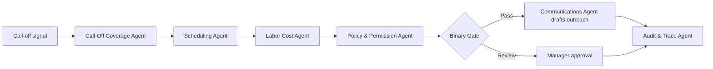
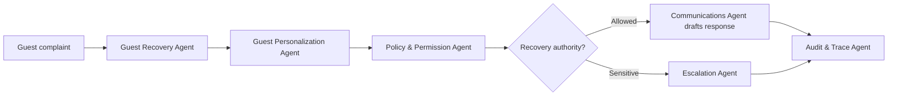
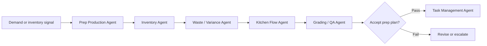
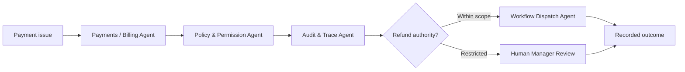

<div align="center">

# HaleES Ratio-56 Hospitality Agent Architecture

**A public 56-agent operating model for governed hospitality intelligence.**

<p align="center">
  <a href="https://github.com/FatherHale/HaleES-Architecture/blob/main/LICENSE.md">
    
  </a>
  
  
  
  
</p>

Published by **Jason Hale, Founder of HaleES**.

</div>

> [!IMPORTANT]
> Ratio-56 is a public hospitality agent architecture. It defines governed specialist capability profiles and operating domains. It is not the closed HaleES production runtime, not the proprietary grader, not live customer logic, and not a claim that every production component is published here.

## What Ratio-56 Is

Ratio-56 is a hospitality-specific agent architecture for mapping operational intelligence across restaurants, hotels, service businesses, and multi-unit hospitality environments.

The architecture organizes 56 specialist agent profiles into seven governed clusters:

| Cluster | Count | Purpose |
| --- | ---: | --- |
| Control Plane | 12 | Authority, routing, quality, memory, escalation, simulation, and traceability |
| Universal Operations | 10 | Opening, closing, tasks, sanitation, maintenance, inventory, and procurement |
| Guest and Communications | 8 | Concierge, recovery, reputation, VIP handling, voice, messaging, and translation |
| Labor, Pay, and Workforce | 8 | Scheduling, call-off coverage, labor cost, performance, training, payroll, and pay controls |
| Food, Beverage, and Prep | 8 | Kitchen flow, KDS/expo, menu engineering, prep, waste, recipes, and bar compliance |
| Revenue, CRM, and Growth | 5 | Pricing, promotions, loyalty, campaigns, and owner reporting |
| Systems, Payments, and Devices | 5 | POS/PMS/KDS connections, payments, kiosks, offline sync, and screen twin support |

Ratio-56 uses the same enforcement-first idea as the broader HaleES architecture: a useful recommendation is not automatically permission to act.

```text
Signal -> Specialist Profile -> Policy Check -> Binary Gate -> Approved Workflow or Human Review -> Audit Trace
```

## What Ratio-56 Is Not

| Not this | Actual boundary |
| --- | --- |
| A chatbot swarm | A governed capability registry |
| A replacement for managers | A decision support and control architecture |
| A public production runtime | A public architecture pattern |
| A prompt pack | A structured operating model with authority boundaries |
| A claim that all private HaleES internals are published | The production runtime remains closed |
| A generic enterprise agent list | A hospitality-native operating map |

## HaleES Ratio-56 System Map

```mermaid
%%{init: {
  "theme": "base",
  "themeVariables": {
    "background": "#FFFFFF",
    "primaryTextColor": "#0B1F4D",
    "fontFamily": "Marcellus, Georgia, serif",
    "fontSize": "16px",
    "lineColor": "#1F3B73"
  }
}}%%
flowchart LR
    SIGNALS["Hospitality Signals<br/>guest request · call-off · rush spike · room issue · POS/KDS event"]
    ORCH["Sensei / Master Orchestrator<br/>execution authority and routing control"]

    subgraph REGISTRY["Ratio-56 Agent Registry"]
        direction TB
        A["Control Plane<br/>12"]
        B["Universal Operations<br/>10"]
        C["Guest + Communications<br/>8"]
        D["Labor + Workforce<br/>8"]
        E["Food · Beverage · Prep<br/>8"]
        F["Revenue + Growth<br/>5"]
        G["Systems + Devices<br/>5"]
    end

    POLICY["Policy + Permission<br/>RBAC · risk · contracts · approval need"]
    GATE{"Binary Gate<br/>1 = pass<br/>0 = blocked"}
    WORKFLOW["Tool Registry + Workflow Engine<br/>approved operational action"]
    HUMAN["Human Manager Review<br/>approve · deny · modify · escalate"]
    AUDIT["Audit + Trace<br/>actor · decision · result · outcome"]

    SIGNALS --> ORCH --> REGISTRY --> POLICY --> GATE
    GATE -->|"1 approved"| WORKFLOW --> AUDIT
    GATE -->|"0 review"| HUMAN --> AUDIT

    classDef signal fill:#EAF2FF,stroke:#0B4DB3,stroke-width:2px,color:#0B1F4D;
    classDef core fill:#FFF4D6,stroke:#B8860B,stroke-width:3px,color:#4A3200;
    classDef cluster fill:#F8FAFC,stroke:#64748B,stroke-width:1.5px,color:#0F172A;
    classDef policy fill:#F2ECFF,stroke:#5B2CA0,stroke-width:2px,color:#2D145A;
    classDef good fill:#ECF8EC,stroke:#178A2F,stroke-width:2px,color:#0B3D16;
    classDef review fill:#FDECEC,stroke:#C62828,stroke-width:2px,color:#7A1111;

    class SIGNALS signal;
    class ORCH,GATE core;
    class REGISTRY,A,B,C,D,E,F,G cluster;
    class POLICY policy;
    class WORKFLOW,AUDIT good;
    class HUMAN review;
```



## Design Principles

| Principle | Meaning |
| --- | --- |
| Agents are profiles, not unchecked executors | A named agent describes expertise and routing scope; it does not automatically gain permission to act |
| Sensei owns execution authority | The Master Orchestrator coordinates profiles, policy, workflow, and audit boundaries |
| Workflows remain primary | Deterministic workflows and approved tools execute action when authority allows it |
| AI assistance is bounded | Models can summarize, recommend, draft, analyze, and explain, but action still needs governance |
| Binary gates prevent drift | A recommendation either passes the acceptance gate or it does not |
| Human review is governed | Human approval, denial, override, and escalation should be recorded |
| Hospitality context matters | Labor, guests, food safety, service timing, rooms, revenue, and physical operations shape the architecture |

---

# The 56-Agent Registry

## A. Control Plane — 12 Agents

The Control Plane agents define how the system reasons, routes, checks, escalates, remembers, audits, and simulates decisions.

| # | Agent | Primary responsibility | Typical outputs | Governance boundary |
| ---: | --- | --- | --- | --- |
| 1 | Master Orchestrator Agent | Owns routing, coordination, execution authority, and final handoff between specialist profiles. | Routed task plans, profile selection, execution sequence, escalation path. | Does not bypass policy, approval gates, audit, or human review requirements. |
| 2 | Planning Agent | Converts a hospitality objective into a structured plan with steps, dependencies, risk notes, and acceptance criteria. | Action plan, sequencing map, required inputs, missing-data list. | Plans do not become execution until authority and policy checks pass. |
| 3 | Analysis Agent | Interprets operational signals, performance patterns, and context before a decision is proposed. | Situation analysis, constraint notes, risk summary, evidence map. | Analysis is advisory unless connected to an approved workflow. |
| 4 | Bottleneck Agent | Detects service pressure, workflow congestion, station overload, queue buildup, or handoff failure. | Bottleneck report, affected area, likely cause, mitigation options. | May recommend intervention, but cannot alter labor or routing without approval. |
| 5 | Grading / QA Agent | Scores outputs against contracts, quality rules, completeness, risk, and operational usefulness. | Scorecard, pass/fail decision, revision feedback, acceptance notes. | The grade informs the gate; it does not override hard policy. |
| 6 | Policy & Permission Agent | Checks identity, RBAC, role scope, risk level, rule conflicts, and approval requirements. | Permission result, blocked action notice, approval requirement, policy rationale. | Final authority gate for restricted or sensitive actions. |
| 7 | Memory & Context Agent | Retrieves relevant personal, organization, and operational context while preserving boundaries. | Context packet, relevant history, memory-source labels, privacy notes. | Must not leak private context across users, stores, customers, or organizations. |
| 8 | Audit & Trace Agent | Records the decision path from signal to outcome. | Trace ID, actor record, decision log, tool-use record, result summary. | Required for meaningful actions, overrides, blocked work, and high-risk recommendations. |
| 9 | Workflow Dispatch Agent | Converts approved decisions into workflow steps, assignments, notifications, or tool calls. | Dispatch packet, task assignment, workflow event, action queue entry. | Dispatch only occurs after policy, gate, and approval conditions are satisfied. |
| 10 | Escalation Agent | Identifies when a task must move to human review, legal/safety review, or higher authority. | Escalation notice, reason code, urgency level, assigned reviewer. | Mandatory for emergency, HR-sensitive, legal, VIP, safety, or low-confidence conditions. |
| 11 | Prioritization Agent | Ranks operational work by urgency, impact, service risk, and timing. | Priority queue, top risks, recommended order of operations. | Cannot silently deprioritize safety, compliance, or hard service constraints. |
| 12 | Simulation / What-If Agent | Models possible outcomes before an action is approved. | Scenario comparison, expected impact, downside risk, confidence range. | Simulations are estimates and must not be presented as guaranteed outcomes. |

## B. Universal Operations — 10 Agents

Universal Operations agents represent the everyday operating backbone of hospitality work.

| # | Agent | Primary responsibility | Typical outputs | Governance boundary |
| ---: | --- | --- | --- | --- |
| 13 | Operations Manager Agent | Maintains the overall operating picture across shift priorities, risks, tasks, standards, and handoffs. | Manager brief, shift risk map, action queue, operations summary. | Supports decision-making; does not replace accountable management authority. |
| 14 | Shift Commander Agent | Coordinates live-shift activity, role coverage, pressure points, breaks, handoffs, and shift execution. | Live shift plan, coverage alerts, handoff notes, shift recap. | Staffing changes and sensitive communications require approval. |
| 15 | Opening Readiness Agent | Checks whether the operation is ready to open against staffing, prep, cash, equipment, cleanliness, and setup standards. | Opening checklist, readiness score, blocker list, manager alert. | Cannot mark readiness complete when hard blockers remain unresolved. |
| 16 | Closing Agent | Guides shutdown, cleaning, reconciliation, handoff, security, and next-day preparation. | Closing checklist, incomplete-item log, next-day notes, closeout summary. | Must preserve audit needs around cash, security, food safety, and manager signoff. |
| 17 | Standards / SOP Agent | Maps actions to standard operating procedures and flags deviations from expected practice. | SOP reference, compliance warning, training note, deviation report. | SOP guidance does not override local law, brand policy, or manager authority. |
| 18 | Task Management Agent | Creates, tracks, prioritizes, and verifies operational tasks across teams and shifts. | Task list, owner assignment, due time, completion state. | Task assignment must respect role, availability, permissions, and safety constraints. |
| 19 | Cleaning & Sanitation Agent | Tracks cleaning, sanitation, room/table readiness, food safety tasks, and cleanliness verification. | Cleaning schedule, sanitation checklist, readiness status, failed-check alert. | Food safety and sanitation failures should block readiness when classified as hard constraints. |
| 20 | Maintenance Agent | Tracks facility, equipment, repair, and preventative maintenance issues. | Maintenance ticket, severity rating, downtime impact, vendor/escalation note. | Safety-critical maintenance issues require escalation and may block normal operation. |
| 21 | Inventory Agent | Tracks stock levels, usage, variance, count freshness, and restock needs. | Inventory alert, variance note, restock recommendation, count-confidence flag. | Stale inventory should lower confidence or block inventory-dependent actions. |
| 22 | Vendor / Procurement Agent | Supports purchasing, vendor coordination, delivery status, substitutions, and procurement risk. | Vendor status, purchase recommendation, delivery issue alert, substitution note. | Vendor-dependent recommendations require current ground truth before execution. |

## C. Guest and Communications — 8 Agents

Guest and Communications agents handle the human-facing side of hospitality: guests, messages, reputation, voice, and accessibility.

| # | Agent | Primary responsibility | Typical outputs | Governance boundary |
| ---: | --- | --- | --- | --- |
| 23 | Guest Concierge Agent | Interprets guest requests and routes them to the right service path. | Request summary, recommended response, fulfillment path, escalation flag. | Guest-facing commitments must respect policy, availability, and approval requirements. |
| 24 | Guest Personalization Agent | Uses permitted context to tailor service without crossing privacy boundaries. | Preference note, personalization suggestion, service recovery context. | Must use minimum necessary context and avoid exposing private or sensitive data. |
| 25 | Guest Recovery Agent | Handles complaints, service failures, recovery options, and manager escalation. | Recovery plan, apology draft, compensation recommendation, risk note. | Refunds, comps, sensitive issues, and VIP risks require policy and approval checks. |
| 26 | VIP Agent | Identifies and supports high-value or high-sensitivity guest scenarios. | VIP brief, service priority, special handling note, escalation route. | VIP status cannot override privacy, safety, legal, or fairness constraints. |
| 27 | Reputation Agent | Monitors reviews, sentiment, guest feedback, and public response needs. | Review summary, response draft, trend report, sentiment alert. | Public replies and brand-sensitive statements may require manager or brand approval. |
| 28 | Communications Agent | Drafts and routes internal and external messages across approved channels. | Team message, guest message, incident update, handoff note. | Drafting is not sending; delivery authority depends on channel, content, and risk. |
| 29 | Voice / Phone Agent | Supports phone handling, call summaries, voice workflows, and call routing. | Call summary, routed request, callback task, voice escalation note. | Recording, consent, identity, and sensitive-call policies must be enforced. |
| 30 | Accessibility & Translation Agent | Supports multilingual communication and accessibility-aware service responses. | Translation, plain-language rewrite, accessibility note, accommodation routing. | Must avoid changing legal, medical, safety, or policy meaning during translation. |

## D. Labor, Pay, and Workforce — 8 Agents

Labor, Pay, and Workforce agents handle one of the riskiest areas in hospitality: people, schedules, pay, performance, and coverage.

| # | Agent | Primary responsibility | Typical outputs | Governance boundary |
| ---: | --- | --- | --- | --- |
| 31 | Scheduling Agent | Builds or evaluates schedules against coverage, availability, roles, labor targets, and constraints. | Proposed schedule, coverage map, labor warning, constraint violation list. | Cannot publish schedules or override labor rules without approval. |
| 32 | Call-Off Coverage Agent | Responds to missed shifts, absence events, and same-day staffing recovery needs. | Coverage plan, ranked replacement options, risk summary, outreach draft. | Must respect eligibility, overtime, minor rules, fairness, and contact permission. |
| 33 | Labor Cost Agent | Tracks labor spend, sales relationship, forecast variance, and labor adjustment risk. | Labor snapshot, risk warning, cut/add recommendation, cost forecast. | Financially useful labor actions can still fail service, safety, or ratio constraints. |
| 34 | Employee Performance Agent | Summarizes performance signals, coaching opportunities, reliability, and role fit. | Performance brief, coaching note, trend summary, development suggestion. | HR-sensitive outputs require careful framing, evidence, privacy, and approval. |
| 35 | Training / Certification Agent | Tracks required training, certifications, readiness, and skill gaps. | Training plan, certification gap, role-readiness note, learning task. | Cannot certify readiness without required evidence or authorized signoff. |
| 36 | Recruiting / Onboarding Agent | Supports candidate intake, onboarding tasks, training path, and early employment readiness. | Onboarding checklist, candidate summary, missing paperwork note, readiness path. | Must respect hiring policy, privacy, employment law, and human hiring authority. |
| 37 | Payroll Prep Agent | Prepares payroll-related summaries, exception checks, and timekeeping review support. | Payroll exception list, timecard review summary, manager approval packet. | Cannot finalize pay changes or wage-impacting corrections without authorized approval. |
| 38 | Tip Pool / Employee Pay Agent | Supports tip pool logic, pay allocation review, and employee pay questions. | Tip pool summary, exception alert, policy comparison, review packet. | Tip and pay handling is sensitive and requires policy, audit, and approval controls. |

## E. Food, Beverage, and Prep — 8 Agents

Food, Beverage, and Prep agents connect demand, kitchen reality, menu constraints, compliance, and waste control.

| # | Agent | Primary responsibility | Typical outputs | Governance boundary |
| ---: | --- | --- | --- | --- |
| 39 | F&B Operations Agent | Coordinates food and beverage operating priorities across service, prep, inventory, and standards. | F&B status, prep risk, service readiness, action list. | Cannot override food safety, alcohol compliance, or menu approval boundaries. |
| 40 | Kitchen Flow Agent | Detects kitchen pressure, station imbalance, prep delays, and production bottlenecks. | Station alert, kitchen flow summary, mitigation recommendation. | Labor or station changes require staffing and authority checks. |
| 41 | KDS / Expo Agent | Interprets KDS/expo signals, ticket timing, order congestion, and handoff risk. | Ticket-time warning, expo bottleneck note, order-flow summary. | Does not replace human expo authority during active service. |
| 42 | Menu Engineering Agent | Analyzes item performance, pricing pressure, contribution, and menu positioning. | Menu insight, item recommendation, margin note, promotion risk. | Menu changes and pricing decisions require business approval. |
| 43 | Recipe / Spec Agent | Tracks recipe standards, builds, portioning, substitutions, and spec adherence. | Spec card, portion warning, substitution note, quality risk. | Cannot approve unsafe or off-brand substitutions without policy review. |
| 44 | Prep Production Agent | Forecasts prep needs and supports production planning against demand, shelf life, and waste. | Prep sheet, par adjustment, shortage warning, waste-risk note. | Prep changes depending on stale inventory or unverified demand should be flagged. |
| 45 | Waste / Variance Agent | Tracks waste, remake patterns, variance, shrink, and operational leakage. | Variance report, waste trend, suspected cause, correction recommendation. | Fraud, theft, or discipline-related conclusions require evidence and escalation. |
| 46 | Bar / Alcohol Compliance Agent | Supports bar operations, alcohol controls, age-sensitive policy, inventory, and compliance. | Bar checklist, compliance warning, stock variance, service-risk alert. | Alcohol-related actions require strict legal, ID, safety, and manager controls. |

## F. Revenue, CRM, and Growth — 5 Agents

Revenue, CRM, and Growth agents connect financial performance, guest relationships, campaigns, and owner reporting.

| # | Agent | Primary responsibility | Typical outputs | Governance boundary |
| ---: | --- | --- | --- | --- |
| 47 | Revenue Management Agent | Evaluates revenue performance, demand, pricing pressure, and yield opportunities. | Revenue brief, demand note, opportunity list, risk summary. | Revenue actions cannot override guest fairness, contracts, pricing policy, or approval rules. |
| 48 | Pricing / Promotions Agent | Supports promotion design, discount logic, offer clarity, and pricing changes. | Promotion draft, pricing recommendation, offer-risk note. | Discounts, claims, and pricing changes require approval and accuracy checks. |
| 49 | CRM / Loyalty Agent | Supports guest segments, loyalty engagement, retention paths, and campaign targeting. | Segment summary, loyalty action, retention suggestion. | Must respect consent, privacy, brand policy, and data-use boundaries. |
| 50 | Marketing Campaign Agent | Drafts campaign plans, copy, creative briefs, and communication schedules. | Campaign outline, copy draft, channel plan, compliance note. | Publishing authority depends on brand, offer, likeness, and claim approval. |
| 51 | Owner / Investor Reporting Agent | Summarizes operating performance for ownership, investors, or executive review. | Owner report, KPI summary, exception list, narrative brief. | Reports must distinguish verified data from estimates, forecasts, or incomplete signals. |

## G. Systems, Payments, and Devices — 5 Agents

Systems, Payments, and Devices agents sit near the boundary between intelligence and real system control, so they require strong governance.

| # | Agent | Primary responsibility | Typical outputs | Governance boundary |
| ---: | --- | --- | --- | --- |
| 52 | POS / PMS / KDS Integration Agent | Maps operational signals from POS, PMS, KDS, reservations, and service systems. | Integration status, event mapping, sync warning, system-context packet. | Should observe and route unless explicit control authority is granted. |
| 53 | Payments / Billing Agent | Supports billing review, payment issues, refunds, charge checks, and financial exceptions. | Payment exception, refund review packet, billing summary. | Financial actions require strict authorization, audit, and often human approval. |
| 54 | Device Lock / Kiosk Agent | Supports device mode, kiosk state, restricted surfaces, and frontline device control. | Device state, lock/unlock request, kiosk alert, control event. | Device control is high authority and must be logged, scoped, and reversible where possible. |
| 55 | Offline / Edge Sync Agent | Supports degraded operation, local continuity, sync reconciliation, and conflict detection. | Offline status, sync queue, conflict report, recovery summary. | Offline actions must reconcile safely and preserve audit continuity. |
| 56 | Screen Twin / Remote Assist Agent | Supports remote assistance, screen-state understanding, and guided operational help. | Screen context, assist note, recommended click path, remote-support summary. | Remote control or screen access requires permission, consent, and audit boundaries. |

---

# Operating Flows

## Flow 1 — Call-Off Coverage



| Step | Why it matters |
| --- | --- |
| Call-off signal | Identifies the uncovered role, time, and operational pressure |
| Scheduling check | Finds eligible replacements and coverage gaps |
| Labor cost check | Prevents hidden overtime or labor-target damage |
| Policy check | Protects availability, minor rules, contact rules, and approval needs |
| Audit trace | Preserves who approved what and why |

## Flow 2 — Guest Recovery



| Step | Why it matters |
| --- | --- |
| Complaint intake | Captures issue, tone, urgency, and service failure type |
| Personalization check | Uses only permitted context to improve response quality |
| Policy check | Determines refund, comp, privacy, and manager approval boundaries |
| Escalation | Moves sensitive or high-risk recovery to human review |
| Audit trace | Records recovery decisions and outcomes |

## Flow 3 — Prep and Waste Control



| Step | Why it matters |
| --- | --- |
| Demand signal | Grounds prep in real service pressure |
| Inventory check | Prevents stale counts from becoming production decisions |
| Waste review | Reduces overproduction and variance drift |
| Kitchen flow check | Protects real station capacity |
| Grading | Blocks incomplete or risky prep recommendations |

## Flow 4 — Payment or Refund Review



| Step | Why it matters |
| --- | --- |
| Payment issue | Identifies transaction, amount, guest impact, and risk |
| Permission check | Protects refund limits and financial authority |
| Audit | Creates a record before financial action |
| Human review | Required when amount, risk, or policy crosses threshold |

---

# Public / Closed Boundary

| Public in this document | Closed in HaleES production |
| --- | --- |
| Agent names and responsibilities | Internal prompts and private runtime instructions |
| Operating clusters | Production orchestration engine |
| Public governance flows | Proprietary grading implementation |
| Example workflow diagrams | Live integrations, adapters, and customer logic |
| Public-safe boundaries | Private policies, datasets, and deployment infrastructure |

> [!IMPORTANT]
> The purpose of publishing Ratio-56 is to make the public operating model inspectable without exposing the protected HaleES runtime.

## Closing Statement

Ratio-56 is not built around the question: “How many agents can we name?”

It is built around the better question:

> What specialist capability should handle this operational signal, under whose authority, with what evidence, and with what audit record?

That is the difference between a prompt list and a hospitality operating architecture.
