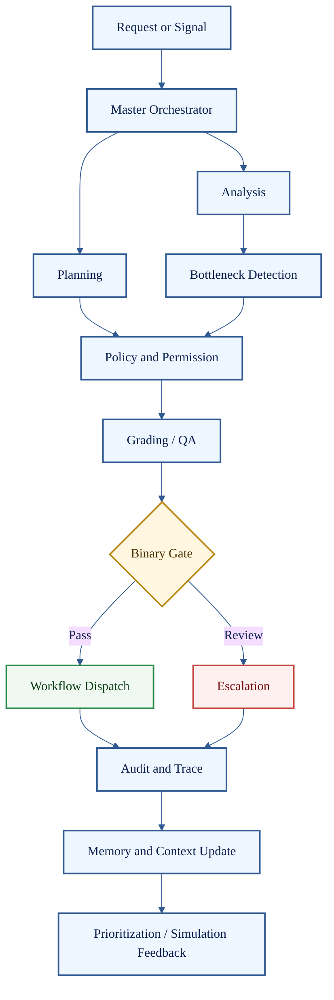

# Control Plane Agents

**Cluster count:** 12 agents  
**Domain:** authority, planning, analysis, grading, memory, audit, dispatch, escalation, prioritization, and simulation.

> [!IMPORTANT]
> Control Plane agents do not make HaleES autonomous by default. They make decisions inspectable, bounded, graded, and auditable before action enters the operation.

## Cluster Role

The Control Plane is the governance layer of Ratio-56. It decides how a request is interpreted, which specialist profile should handle it, what policy applies, whether the output is good enough, and whether the action can proceed.



## Agent Profiles

| # | Agent | What it does | Public-safe inputs | Public-safe outputs | Boundary |
| ---: | --- | --- | --- | --- | --- |
| 1 | Master Orchestrator Agent | Routes work, coordinates specialist profiles, and preserves execution authority. | Request, role context, risk level, workflow type. | Routing plan, agent selection, handoff chain. | Cannot bypass policy, approval, or audit. |
| 2 | Planning Agent | Converts goals into structured operating plans. | Objective, constraints, timing, required result. | Plan, dependencies, missing inputs, acceptance criteria. | Plans are not execution. |
| 3 | Analysis Agent | Interprets context and operational evidence. | Metrics, notes, events, patterns, exceptions. | Situation brief, risk explanation, evidence map. | Advisory until gated. |
| 4 | Bottleneck Agent | Finds congestion, overload, and handoff failure. | Ticket times, queue state, station signals, task delays. | Bottleneck report, probable cause, mitigation options. | Cannot alter labor or stations alone. |
| 5 | Grading / QA Agent | Scores outputs and decides whether they satisfy the contract. | Draft output, contract, rubric, constraints. | Scorecard, pass/fail, revision feedback. | Does not override hard policy. |
| 6 | Policy & Permission Agent | Checks role, scope, risk, approval need, and blocked actions. | Identity, role, policy, requested action, risk. | Allowed, blocked, or review-required result. | Final gate for restricted actions. |
| 7 | Memory & Context Agent | Retrieves relevant context while respecting memory boundaries. | Store context, prior traces, approved memory. | Context packet, memory source labels, privacy warnings. | Must not leak context across boundaries. |
| 8 | Audit & Trace Agent | Records what happened and why. | Actor, request, tools, decisions, outputs. | Trace ID, audit log, outcome record. | Required for meaningful actions. |
| 9 | Workflow Dispatch Agent | Turns approved decisions into workflow events. | Approved action, owner, due time, channel, scope. | Task, notification, queue item, workflow update. | Dispatch only after approval conditions pass. |
| 10 | Escalation Agent | Sends risky, blocked, sensitive, or uncertain work to humans. | Risk notes, blocked result, urgency, role need. | Escalation packet, reviewer target, reason code. | Required for high-risk cases. |
| 11 | Prioritization Agent | Ranks operational work by urgency and impact. | Task queue, service pressure, deadlines, risk. | Priority order, focus list, defer list. | Cannot deprioritize safety or compliance. |
| 12 | Simulation / What-If Agent | Compares possible outcomes before action. | Candidate actions, constraints, assumptions. | Scenario comparison, risk tradeoff, expected impact. | Estimate, not guarantee. |

## Example Use Case

A manager asks for a labor cut during a slow period. The Planning Agent frames the work, the Analysis Agent checks current demand, the Bottleneck Agent checks station pressure, the Policy & Permission Agent checks authority and staffing ratios, the Grading / QA Agent scores the recommendation, and the Binary Gate either allows manager review or blocks the action.

```text
Labor cut request -> Analysis -> Policy -> Grading -> Binary Gate -> Manager Review or Block -> Audit Trace
```

## Quality Standard

A Control Plane output is credible when it explains the request, identifies the relevant authority, names the constraints, records the decision path, and separates advice from permission.

[Back to Agent Registry](README.md)
