# Guest and Communications Agents

**Cluster count:** 8 agents  
**Domain:** concierge, personalization, recovery, VIP handling, reputation, communications, voice, accessibility, and translation.

> [!IMPORTANT]
> Guest-facing intelligence must protect privacy, tone, brand promises, compensation authority, and escalation boundaries.

## Cluster Role

Guest and Communications agents support service recovery, guest requests, internal and external messaging, VIP handling, public reputation, phone workflows, and language accessibility.

```mermaid
%%{init: {"theme":"base", "themeVariables": {"background":"#FFFFFF", "fontFamily":"Marcellus, Georgia, serif", "fontSize":"16px", "primaryTextColor":"#0B1F4D", "lineColor":"#315A92"}}}%%
flowchart LR
    A[Guest Signal] --> B[Guest Concierge]
    B --> C[Guest Personalization]
    B --> D[Guest Recovery]
    D --> E[Policy + Permission]
    C --> E
    E --> F{Send or Escalate?}
    F -->|Send allowed| G[Communications]
    F -->|Sensitive| H[Escalation / Manager Review]
    G --> I[Reputation / Voice / Translation Support]
    H --> I
    I --> J[Audit + Outcome]

    classDef blue fill:#EEF6FF,stroke:#315A92,stroke-width:2px,color:#0B1F4D;
    classDef purple fill:#F5F0FF,stroke:#6B46C1,stroke-width:2px,color:#2D145A;
    classDef gold fill:#FFF7DF,stroke:#B88712,stroke-width:2px,color:#4A3200;
    classDef red fill:#FFF0F0,stroke:#C2413B,stroke-width:2px,color:#7A1111;
    class A,B,C,D,I,J blue;
    class E,F gold;
    class G purple;
    class H red;
```



## Agent Profiles

| # | Agent | What it does | Public-safe inputs | Public-safe outputs | Boundary |
| ---: | --- | --- | --- | --- | --- |
| 23 | Guest Concierge Agent | Interprets guest requests and routes them to the right service path. | Guest request, channel, location, urgency. | Request summary, fulfillment path, escalation flag. | Cannot promise unavailable services or unauthorized compensation. |
| 24 | Guest Personalization Agent | Uses permitted context to tailor service. | Approved preferences, stay/visit context, service notes. | Personalization suggestion, preference note. | Uses minimum necessary context only. |
| 25 | Guest Recovery Agent | Handles complaints, service failures, and recovery options. | Complaint, incident details, service history, policy. | Recovery plan, apology draft, compensation recommendation. | Refunds/comps/sensitive issues require policy checks. |
| 26 | VIP Agent | Supports high-value or high-sensitivity guest scenarios. | VIP flag, service promise, known preferences, risk. | VIP brief, priority note, escalation route. | VIP status cannot override privacy or safety. |
| 27 | Reputation Agent | Monitors feedback, reviews, sentiment, and public response needs. | Review, survey, sentiment, public channel. | Response draft, trend report, alert. | Public replies may require approval. |
| 28 | Communications Agent | Drafts and routes internal or external messages. | Message intent, audience, channel, urgency. | Draft, notification packet, handoff note. | Drafting is not sending. |
| 29 | Voice / Phone Agent | Supports call handling, summaries, routing, and callbacks. | Call transcript/summary, caller intent, phone channel. | Call summary, callback task, routing note. | Consent, recording, and identity rules apply. |
| 30 | Accessibility & Translation Agent | Supports multilingual and accessibility-aware communication. | Original message, target language, accessibility need. | Translation, simplified wording, accommodation route. | Must not alter legal, safety, or policy meaning. |

## Example Use Case

A guest reports a serious service failure through a review and asks for compensation. The Guest Recovery Agent drafts the recovery path, Policy & Permission checks compensation limits, Communications drafts the response, and the Escalation Agent routes manager review if needed.

```text
Guest complaint -> Recovery analysis -> Policy check -> Draft response -> Manager review or send -> Audit trace
```

## Quality Standard

A guest-facing output is credible when it is accurate, respectful, policy-aware, privacy-safe, and clear about what is promised versus what requires approval.

[Back to Agent Registry](README.md)
