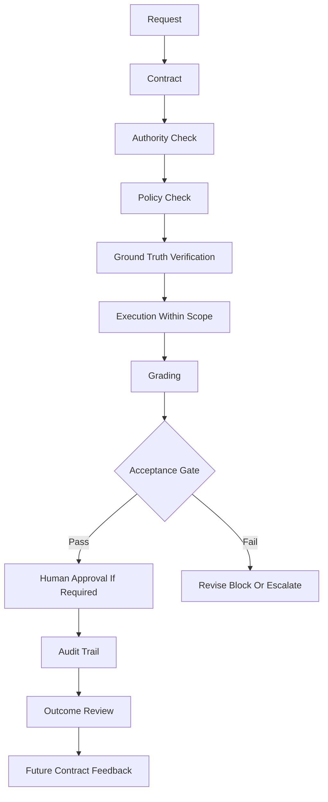

<div align="center">

# HaleES Whitepaper Reader

## Enforcement First AI Operations for Hospitality

**A designed public reader for the HaleES enforcement-first architecture paper.**

<p align="center">
  
  
  
  
</p>

</div>

> [!IMPORTANT]
> **Core claim:** A useful AI answer is not the same thing as a safe decision. A safe decision is not the same thing as permission to act.

> [!NOTE]
> This folder is the visual reader version of the whitepaper. The single-file archive remains at [`FULL_WHITEPAPER.md`](../FULL_WHITEPAPER.md).

---

## What “Runtime Closed” Means

> [!IMPORTANT]
> **Runtime closed** means this public repository explains the HaleES architecture pattern, not the working production engine.

| Public paper can show | Closed runtime does not expose |
| --- | --- |
| Architecture concepts | Production orchestration code |
| Governance flows | Private grader implementation |
| Contract examples | Real model/tool routing |
| Public diagrams | Live integrations |
| Schemas and mock loops | Customer data handling |
| Public-safe constants | Deployment and infrastructure internals |
| Design principles | Commercial execution workflows |

The pattern is public. The operating engine remains closed.

---

## Reader Map

| Part | File | Focus |
| --- | --- | --- |
| 01 | [Why Enforcement Comes First](01-why-enforcement-comes-first.md) | Problem, central claim, hospitality context, governed execution |
| 02 | [Authority Before Action](02-authority-before-action.md) | Authority, policy, contracts, and permission boundaries |
| 03 | [Identity as Constraint](03-identity-as-constraint.md) | Staffing ratios, identity constants, ground truth, grading |
| 04 | [Consequence Loops](04-consequence-loops.md) | Outcome review, iteration, drift, identity, emergency mode, audit |
| 05 | [Hospitality Use Cases](05-hospitality-use-cases.md) | Call-off handling, labor adjustment, vendor decisions, creative governance |
| 06 | [Open Pattern, Closed Runtime](06-open-pattern-closed-runtime.md) | Public architecture vs closed runtime, design principles, conclusion |

---

## Executive Signal

| HaleES separates | Why it matters |
| --- | --- |
| Knowledge from authority | Knowing is not permission |
| Generation from acceptance | Output does not equal trust |
| Confidence from proof | A confident system can still be wrong |
| Human approval from override | Review is not a loophole |
| Public architecture from closed runtime | The pattern can be inspected without exposing the engine |

---

## Enforcement First Flow

```text
Request -> Contract -> Authority Check -> Policy Check -> Ground Truth Verification -> Execution Within Scope -> Grading -> Acceptance Gate -> Human Approval If Required -> Audit Trail -> Outcome Review -> Future Contract Feedback
```

<details>
<summary><strong>View governed execution diagram</strong></summary>



</details>

---

## How To Read This Paper

Start with **Why Enforcement Comes First** if you want the thesis. Start with **Authority Before Action** if you care about permission. Start with **Identity as Constraint** if you want the staffing-ratio layer. Start with **Hospitality Use Cases** if you want to see the pattern in restaurant operations.

> [!TIP]
> The reader version is designed for GitHub mobile and public scanning. The full archive remains available as one file for citation and preservation.
